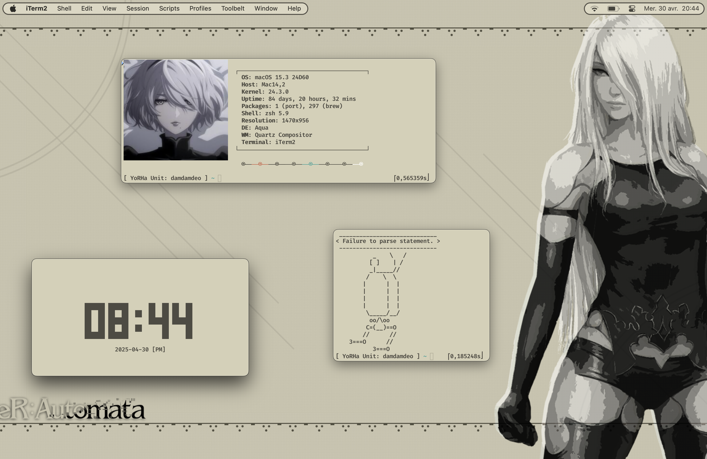
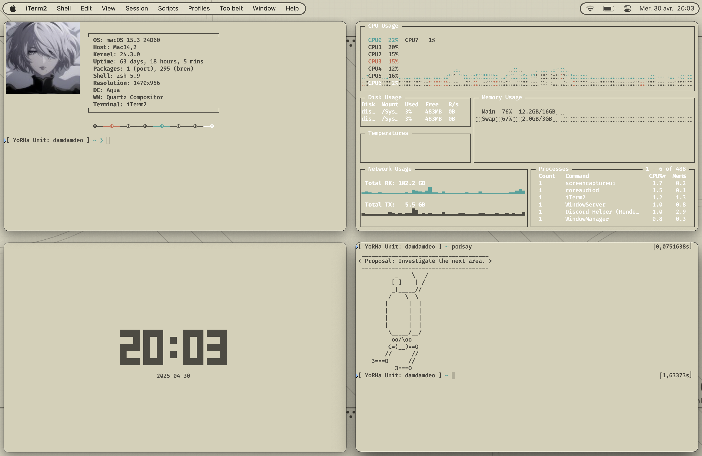
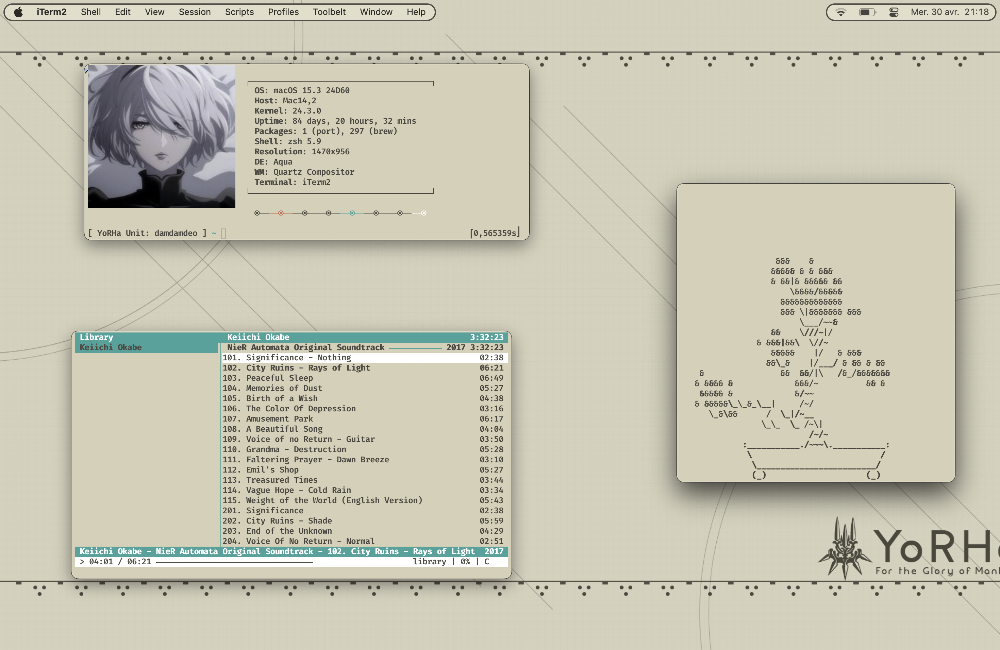
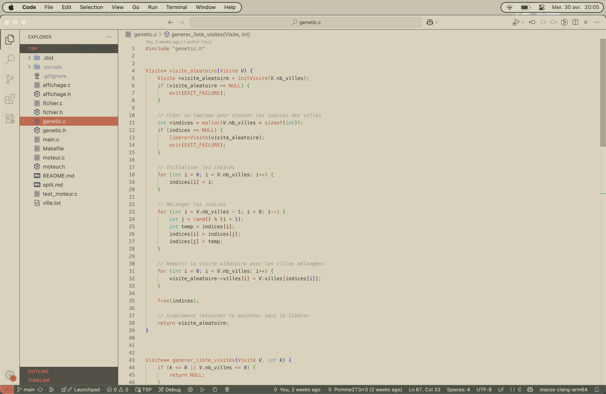
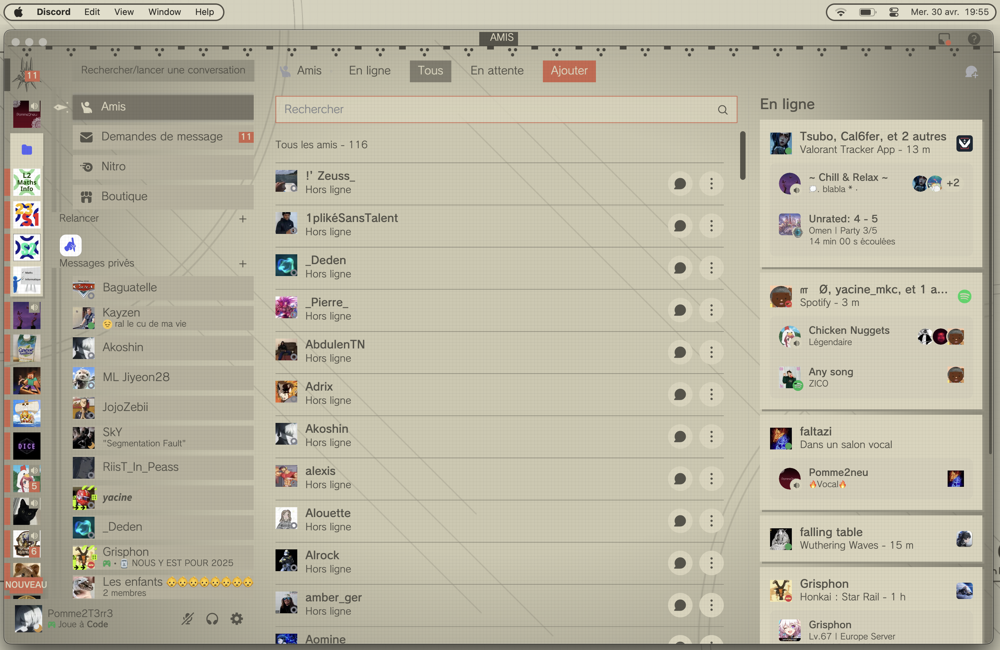
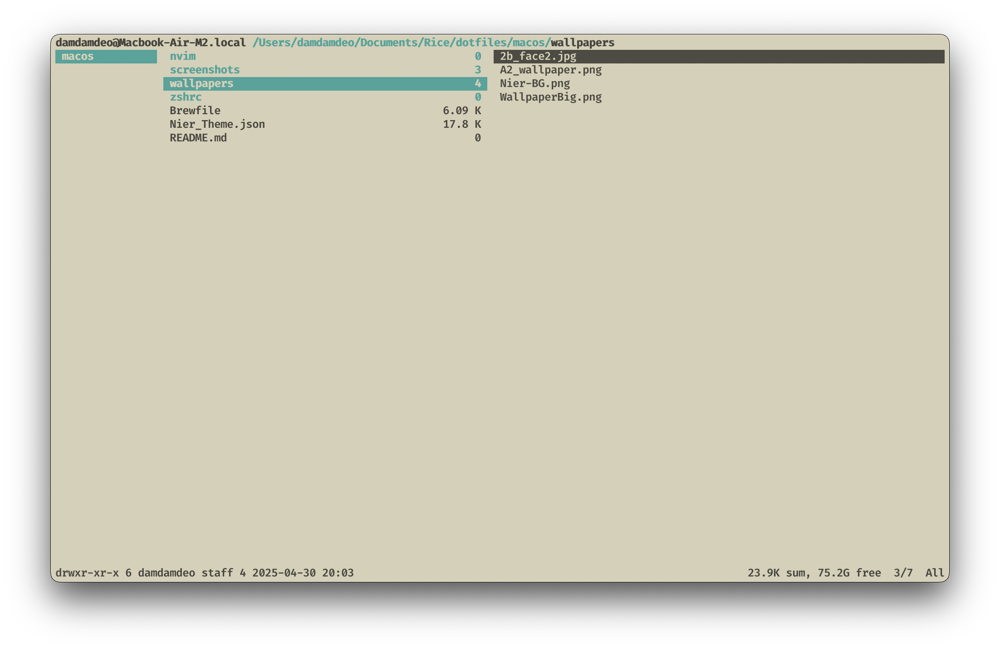
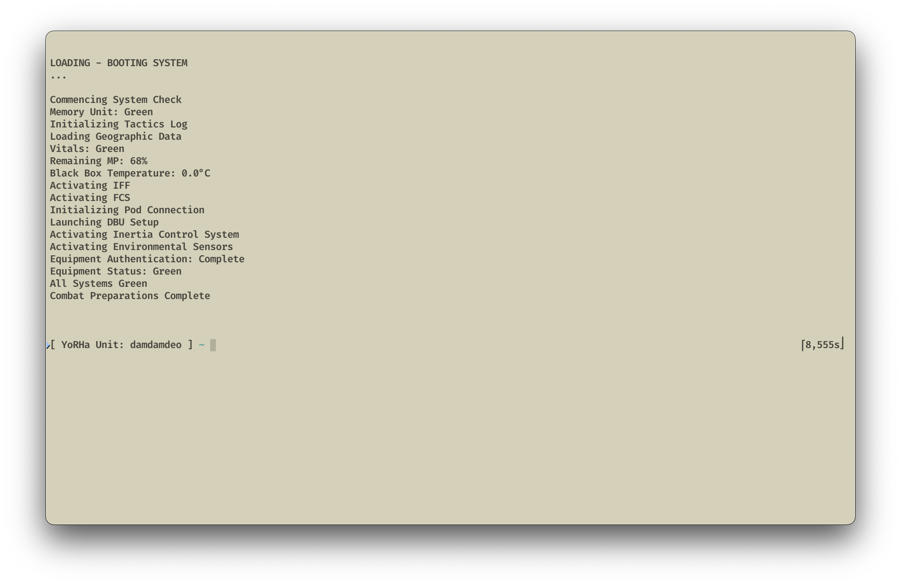

# Dotfiles MacOS - Nier Automata theme

This repository contains my personal macOS dotfiles, design inspired by *NieR: Automata*, and for a visually pleasing development environment.

## Features

- Configurations for `zsh`, `brew`, `iterm2`, `vscode`.   
- Custom terminal color theme (iterm2): `Nier_Theme.json`.

## Screenshots

*Neofetch, tty-clock and  (a little CLI program, reference to Nier: Automata)*

*Neofetch, tty-clock, podsay and gotop (alternative to htop).*

*cmus, in-terminal music player.*

*Visual Studio Code w Nier: Automata theme.*

*same w discord*

*bash program, reference to Nier*

## Tools
OS : MacOS 15.3

WM : Quartz

DE : Aqua

Terminal : iterm2

Shell : zsh

Package Panager : brew, port

File Explorer : ranger, nnn

Audio Player : cmus

Bar : Ice

## 📄 License

This project is licensed under the [MIT License](https://opensource.org/licenses/MIT). Feel free to use, modify, or share.

---
